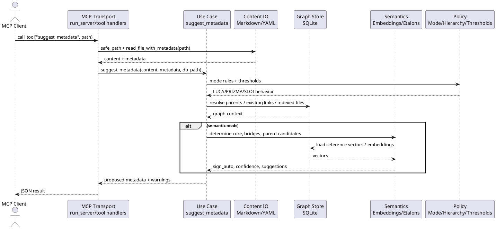

# NOUZ Architecture Refactor

This note is the working map for refactoring NOUZ-MCP without changing its behavior.

## Why Refactor

Refactoring means changing the shape of the code while keeping the product behavior the same.

Right now, `nouz_mcp/server.py` still knows too much. It accepts MCP calls, reads Markdown,
parses YAML, writes SQLite rows, calls embeddings, classifies signs, applies mode rules, and
formats tool responses. That was useful for a prototype: one file is easy to start and easy to
search. But as NOUZ grows, one large file becomes risky. A small fix in YAML can accidentally
break indexing; a sign change can affect MCP output; a database migration can touch unrelated
logic.

The goal is not "pretty files". The goal is lower risk:

- each layer has one job;
- each layer has a small API;
- tests prove behavior before and after each move;
- old public tool behavior stays compatible while internals move.

## Versions

### Version A: Minimal Extraction

Move tiny independent helpers out of `server.py`, but keep compatibility wrappers.

Target modules:

- `paths.py`: path safety, database path resolution;
- `vault_io.py`: Markdown file reads from the vault;
- `serialization.py`: JSON/YAML-safe value conversion;
- `vectors.py`: cosine similarity and mean-centering;
- `config.py`: defaults, config loading, profiles;
- `markdown.py`: Markdown/YAML parsing and dumping;
- `modes.py`: LUCA/PRIZMA/SLOI mode policy helpers;
- `links.py`: parent-link normalization and parent existence checks;
- `signs.py`: sign parsing and artifact-sign heuristics;
- `semantics.py`: LLM tag extraction and embedding client calls;
- `sqlite_store.py`: SQLite schema, migrations, and simple graph-link reads.
- `use_cases.py`: application workflows that compose IO, store, semantics, and policy.

This is the safest first stage. It reduces file size and creates obvious seams without changing
the MCP API.

### Version B: Layered Server

Split the server by responsibility.

Proposed structure:

```text
nouz_mcp/
  server.py              # MCP entrypoint and tool registration
  app/
    tools.py             # tool use cases: read/write/index/suggest/recalc
  config.py              # config loading, profiles, thresholds
  domain/
    metadata.py          # NOUZ metadata shape and normalization
    signs.py             # sign and artifact_sign rules
    modes.py             # LUCA/PRIZMA/SLOI policy
    links.py             # parents_meta and link types
  io/
    markdown.py          # frontmatter and file body handling
    paths.py             # vault path safety
  store/
    sqlite.py            # DB reads/writes
    migrations.py        # schema changes
  semantics/
    embeddings.py        # embedding providers and cache
    etalons.py           # reference vectors
    bridges.py           # semantic/tag bridges
    vectors.py           # vector math
```

This is the recommended target for the current project. It is structured, but not overbuilt.

### Version C: Explicit Interfaces

Introduce formal interfaces such as:

- `VaultReader`
- `VaultWriter`
- `GraphStore`
- `EmbeddingProvider`
- `ModePolicy`
- `SignPolicy`

This version makes it easier to support other vault backends later, but it is too much for the
first pass. It should come after Version B is stable.

## Chosen Direction

NOUZ 3.1.0 ships Version A: focused single-responsibility modules at the top level
of `nouz_mcp/`, with `server.py` reduced to bootstrap, thin delegating wrappers, and
MCP tool handlers. Version B (explicit `app/`, `domain/`, `io/`, `store/`,
`semantics/` subpackages) is the next step, not the current state.

Version C (formal interface protocols) is deliberately not in scope yet. NOUZ
needs clear layers first, not a large abstraction system.

### Why semantic helpers stay in `server.py` for now

The remaining intentionally-not-extracted helpers in `server.py` are the
semantic-service surface: `_find_semantic_bridges`, `_find_tag_bridges`,
`_determine_core_by_embedding`, `_calibrate_reference_vectors`,
`_determine_sign_smart`, and `_find_temporary_anchor`. They read several
module-level globals (`RULE`, `CORE_SIGNS`, `CONFIG`, thresholds, `_get_embedding`).
Extracting them cleanly requires introducing a `SemanticService` with explicit
config and embedder injection, which is a meaningful design change rather than
a code move. That work belongs in a separate release (target: 3.2.0) so 3.1.0
stays a pure refactor with stable behavior.

## Current Layer Model

```text
MCP Transport
  Receives tool calls and returns MCP TextContent.

Application / Use Cases
  read_file, write_file, index_all, suggest_metadata, recalc_signs, process_orphans.

Domain
  Entity metadata, links, signs, artifact signs, hierarchy policy, mode behavior.

Content IO
  Markdown files, frontmatter parsing, YAML dumping, safe paths, body preservation.

Graph Store
  SQLite tables, migrations, file index, parent/child links, embeddings cache.

Semantics
  embeddings, etalons, cosine/mean-centering, semantic bridges, tag bridges, core_mix.

Config / Policy
  config files, profiles, thresholds, mode flags, artifact keyword rules.
```

## Sequence Diagram

Paste this into https://plantuml.online/uml/ to review the current understanding.



## Test Contract

Before and after every refactor step, run:

```powershell
python -m py_compile nouz_mcp\server.py nouz_mcp\config.py nouz_mcp\links.py nouz_mcp\paths.py nouz_mcp\serialization.py nouz_mcp\vectors.py nouz_mcp\markdown.py nouz_mcp\modes.py nouz_mcp\signs.py nouz_mcp\semantics.py nouz_mcp\sqlite_store.py nouz_mcp\use_cases.py nouz_mcp\vault_io.py pytest_smoke.py
python test_server.py
python -m pytest -q pytest_smoke.py
python -m pytest -q
```

For any new extracted module, add direct smoke tests.

Critical behaviors that must stay stable:

- path traversal is blocked;
- Markdown without YAML still reads as content;
- Markdown horizontal rules are not mistaken for frontmatter;
- `write_file_with_metadata` preserves body content by default;
- internal computed fields do not leak into YAML;
- parent/child links are stored and read correctly;
- `read_file` refreshes the index and reports missing-parent warnings;
- `write_file` and `update_metadata` preserve body/metadata contracts and cycle guards;
- `add_entity` creates the same result shape after moving creation logic to use cases;
- L1 core signs are not overwritten by `recalc_signs`;
- L4 signs stay separate from child artifact signs;
- `suggest_metadata` keeps semantic/tag bridges, cycle errors, and drift warnings stable;
- `process_orphans` respects dry-run/limit behavior.

## Refactor Rules

- Keep public MCP tool names and result shapes stable.
- Move code in small pieces.
- Keep compatibility wrappers in `server.py` until all tests and docs are updated.
- Do not edit real Obsidian content during public-server refactoring.
- Do not publish local-only runtime files, tokens, root `config.yaml`, local DBs, or personal vault contents.
- Prefer adding tests before moving risky logic.

## Completed Steps

- Ran a stabilization pass after moving read/write/update: removed an obsolete
  `process_orphans` dependency callback, recompiled modules, reran smoke/full tests,
  checked diff whitespace, and scanned for obvious secret strings.
- Extracted path helpers into `nouz_mcp/paths.py`.
- Extracted serialization helpers into `nouz_mcp/serialization.py`.
- Extracted vector math into `nouz_mcp/vectors.py`.
- Extracted Markdown/frontmatter helpers into `nouz_mcp/markdown.py`.
- Extracted mode and level helpers into `nouz_mcp/modes.py`.
- Extracted config defaults, profile application, and config file loading into `nouz_mcp/config.py`.
- Extracted parent-link normalization and parent existence checks into `nouz_mcp/links.py`.
- Extracted sign parsing and artifact-sign heuristics into `nouz_mcp/signs.py`.
- Extracted LLM tag extraction and embedding client calls into `nouz_mcp/semantics.py`.
- Extracted Markdown vault reads into `nouz_mcp/vault_io.py`.
- Extracted application workflows `read_file`, `write_file`, `update_metadata`, `index_all_files`, `list_files`, `suggest_parents`, `suggest_metadata`, `process_orphans`, `add_entity`, `recalc_signs`, and `recalc_core_mix` into `nouz_mcp/use_cases.py`.
- Extracted plain text file reads/writes into `nouz_mcp/vault_io.py`.
- Extracted SQLite schema/migration, file indexing, core_mix aggregation/loading, basic graph-link reads, orphaned-link lookup, parent-candidate queries, embedding freshness/storage/loading, reference-vector storage, entity-path lookup, semantic-bridge candidate rows, tag-bridge candidate rows, and temporary-anchor candidate rows into `nouz_mcp/sqlite_store.py`.
- Removed direct SQLite usage from `nouz_mcp/server.py`; MCP/server code now calls store helpers instead of issuing SQL.
- Removed old private compatibility aliases from `nouz_mcp/server.py` such as helper wrappers for
  paths, Markdown parsing/dumping, vector math, serialization, graph reads, embedding storage,
  and orphan lookup. Tests now exercise those helpers through their owning modules.
- Added smoke coverage for extracted helpers.
- Verified packaging with `python -m build --no-isolation --sdist --wheel` into an ignored temporary build directory;
  the wheel includes all newly extracted package modules.
- Ran a release-candidate public-file pass: removed obsolete threshold/dependency remnants,
  clarified the embedding provider description in
  `server.json`, included `docs/*.md` in the source distribution, and verified wheel import/entry point
  from an installed `--target` directory outside the repository source tree.

## Remaining Refactor Targets (post-3.1.0)

- Extract the semantic-service surface (`_determine_core_by_embedding`,
  `_find_semantic_bridges`, `_find_tag_bridges`, `_calibrate_reference_vectors`,
  `_determine_sign_smart`, `_find_temporary_anchor`) into a `SemanticService`
  module that takes config, rule, and embedder by constructor injection rather
  than reading module-level globals.
- Once the semantic service is in place, evaluate the Version B subpackage
  layout (`app/`, `domain/`, `io/`, `store/`, `semantics/`) and decide whether
  the extra hierarchy still earns its weight.
- Remove ignored local build artifacts after Windows releases file locks
  (`.build-tmp/`, `build/`, `*.egg-info/`, `pytest-cache-files-*/`).
